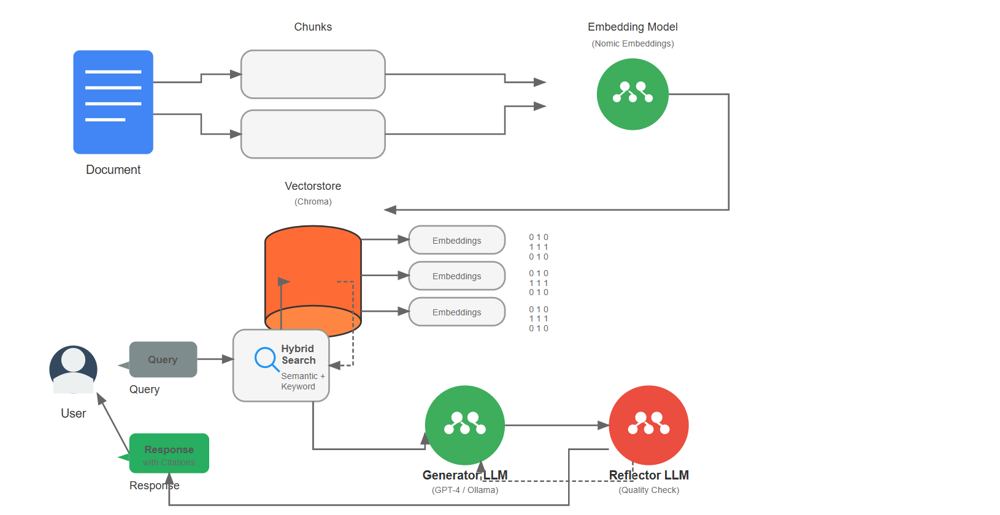

# Backend – Intelligent Document Q&A

This package hosts the FastAPI + LangGraph service that powers the Intelligent Document Q&A solution. It ingests PDF/DOCX/TXT uploads, stores chunk metadata and embeddings locally, and exposes `/ingest` + `/query` endpoints that run a self-reflective RAG pipeline with grounded citations.



## Key Components
- **FastAPI** server (`src/app/server.py`) with ingestion + question routes.
- **LangChain / LangGraph** self-RAG graph (`src/app/graph.py`) implementing retrieve → draft → reflect loops.
- **Embeddings** via HuggingFace `nomic-ai/nomic-embed-text-v1.5`.
- **Vector store**: local Chroma persisted under `backend/data/vectorstore`.
- **Hybrid retrieval**: dense Chroma retriever + BM25 sparse retriever with LongContext reranking.
- **LLM service**: OpenAI GPT-4o-mini by default (via `langchain-openai`), with the ability to switch to local Ollama Mistral.
- **Observability** helpers (`src/app/observability.py`) for OTLP traces + Prometheus metrics.

## Repository Layout
| Path | Purpose |
|------|---------|
| `src/app/` | Application modules (config, CLI, ingestion, retriever, LangGraph, server, observability). |
| `src/tests/` | Basic ingestion/retrieval unit tests. |
| `data/` | Runtime artifacts (uploads, chunk metadata, vectorstore). Empty placeholders are committed so the backend can write to them at runtime. |
| `docs/` | Architecture, implementation guide, evaluation plan, monitoring config. |
| `sample_data/` | Example queries / documents for quick smoke tests. |

## Setup
```bash
cd backend
python -m venv .venv
source .venv/bin/activate
pip install -e .
cp .env.example .env   # edit values described below
```

### Environment (.env)
| Variable | Description |
|----------|-------------|
| `RAG_ENVIRONMENT` / `RAG_DEBUG` | Basic runtime flags. |
| `RAG_MODEL__LLM_PROVIDER` | `openai` *(default)* or `ollama`. |
| `OPENAI_API_KEY` | Required when `llm_provider=openai`. |
| `RAG_MODEL__LLM_MODEL` | e.g. `gpt-4o-mini` or `mistral-7b-instruct`. |
| `RAG_MODEL__LLM_BASE_URL` | Ollama base URL if using local models. |
| `RAG_MODEL__EMBED_MODEL` | Defaults to `nomic-ai/nomic-embed-text-v1.5`. |
| `RAG_OBSERVABILITY__ENABLE_TRACING` / `RAG_OBSERVABILITY__OTLP_ENDPOINT` | Toggle tracing + configure collector. |

## Running the API
```bash
uvicorn src.app.server:app --reload --port 8000
```
- `POST /ingest` accepts multipart uploads (`file`, optional `uploaded_by`) and persists raw files under `data/uploads/`.
- `POST /query` expects `{ "question": "...", "filters": { ... } }` and returns the `answer`, `citations`, `evidence`, `confidence`, latency, and `not_found_reason`.

## CLI Shortcuts
```bash
# Ingest from disk
python -m src.app.cli ingest path/to/document.pdf

# Run a one-off question
python -m src.app.cli ask "What benefits of supervised learning are described?"

# Batch evaluation (writes data/evaluations/latest.json)
python -m src.app.cli evaluate
```

## Data Directories
- `data/uploads/` – raw files saved during ingestion.
- `data/metadata/` – JSONL chunk manifests (used by BM25 retriever).
- `data/vectorstore/` – persistent Chroma collection.

All three folders are created automatically on startup and are intentionally empty in source control. Delete the contents if you need a clean slate; the service will repopulate them as you ingest documents.

## Observability & Metrics
- Enable `RAG_OBSERVABILITY__ENABLE_TRACING=true` to emit OTLP traces.
- Prometheus metrics (latency histogram + token counters) are registered via `observability.py`. Expose `/metrics` by adding the `prometheus_client` ASGI middleware if desired.
- `docs/prometheus.yml` and `docker-compose.yml` include starter configs for running Jaeger/Prometheus/Grafana locally.

## Performance & Caching
- **LLM response caching**: set `RAG_CACHE__ENABLED=true` (and optionally `RAG_CACHE__PATH` in `.env`) to let the app boot with a SQLite-backed LangChain cache. You can also point `LANGCHAIN_CACHE` to an external backend if preferred. When a cache is active, `run_graph` memoizes answers per question so repeated queries return instantly.
- **Ingestion dedupe**: each chunk is stored under a deterministic `chunk_id` (document hash + chunk index). The embedding service skips IDs that are already in Chroma’s collection, so re-ingesting the same file avoids redundant embedding work.
- **Vector persistence**: Chroma automatically persists to `backend/data/vectorstore`, so restarts do not require re-indexing unless you delete the files.

## Frontend & Docker
- The Streamlit UI in `../frontend` targets this backend. Run both services locally or `docker-compose up --build` from the repo root.
- The provided `Dockerfile` builds a slim image with dependencies from `pyproject.toml`.

## Supporting Docs
- `docs/architecture.md` + `docs/architecture.png` — visual system overview.
- `docs/implementation_guide.md` — step-by-step setup plus LangGraph details.
- `docs/evaluation_plan.md` — mapping to the provided acceptance tests.
- `docs/solution_overview.md` — rationale for technology choices.

Refer to those documents for deeper dives into the LangGraph flow, evaluation harness, and deployment considerations.
