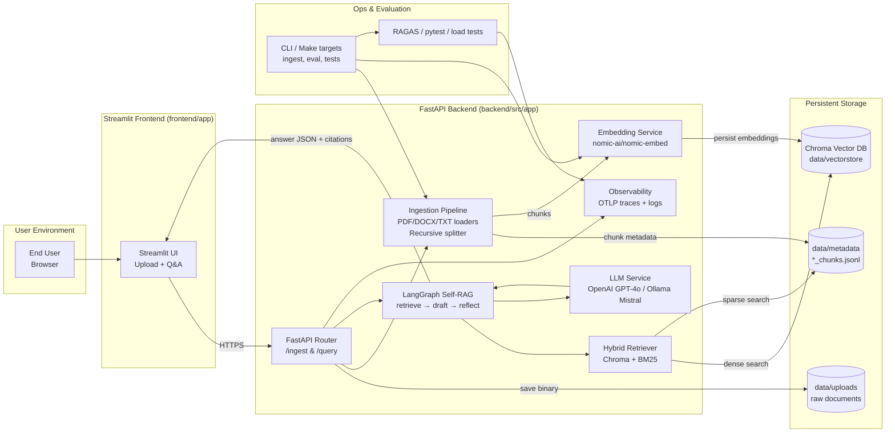

# Intelligent Document Q&A System – Architecture

## 1. Goals and Context
- **Mission**: build a production-ready Retrieval Augmented Generation (RAG) service that answers grounded questions over user-uploaded PDFs/DOCX/TXT.
- **Drivers**: correctness with citations, observability, cost-awareness, and alignment with the LangChain/LangGraph “Self-RAG” patterns referenced in the brief.
- **Constraints**:
  - Run locally by default (Nomic embeddings + Chroma vector store + optional Ollama Mistral), while allowing an OpenAI fallback for accuracy.
  - Support re-indexing, metadata-rich storage, hybrid retrieval, and explicit “I don’t know” handling.

## 2. High-Level Architecture

### 2.1 End-to-End Visualization

**Legend**
- **Solid arrows**: synchronous request/response paths.
- **Rounded boxes**: services/components.
- **Stacked cylinders**: persisted data (local filesystem / Chroma DB).
- **Subgraphs**: logical tiers (client, frontend, backend, storage, tooling).

### 2.2 Runtime Flow (Narrative)
1. **User action**: uploads files or asks questions via the Streamlit frontend.
2. **FastAPI** accepts uploads, writes them under `backend/data/uploads`, then triggers the ingestion worker.
3. **Ingestion pipeline** (LangChain loaders + recursive splitter) normalizes text, emits chunk metadata (`data/metadata/*_chunks.jsonl`), and hands chunks to the embedding service.
4. **Embedding service** generates Nomic embeddings and stores them in a persistent Chroma collection (`data/vectorstore`).
5. **Query requests** run through LangGraph’s self-reflective RAG graph: hybrid retrieval (dense Chroma + BM25 sparse) → draft answer → optional reflection.
6. **LLM service** fans out to OpenAI GPT-4o (via `OPENAI_API_KEY`) or local Ollama Mistral, enforcing grounding/citation prompts.
7. **Responses** are returned to the frontend with structured citations, latency, and “not found” reasons. Traces/logs are exported to OTLP / Prometheus targets for observability.

### LangGraph Flow (Self-RAG inspired)
1. **Retriever Node**: dense + BM25 hybrid fetch with metadata filters; dedupe chunks.
2. **Draft Answer Node**: compose prompt with retrieved context, policies (citations, refusal).
3. **Evaluator Node**: check grounding (SelfCheck-style) + coverage; may trigger reflection.
4. **Reflect/Re-retrieve Node**: optionally expand search radius or modify query if evaluator fails.
5. **Finalizer Node**: produce answer with structured citations and “not found” reason if evidence is missing.

## 3. Component Breakdown
| Layer | Responsibilities | Key Tech |
|-------|-----------------|----------|
| Ingestion | File validation, parsing (PDF/PPT/DOCX/TXT), normalization, chunking, metadata capture | LangChain loaders (`PyPDFLoader`, `Docx2txtLoader`, `UnstructuredPowerPointLoader`, `TextLoader`), RecursiveCharacterTextSplitter |
| Storage | Persist raw docs + chunk metadata on disk | Local filesystem (`data/uploads`, `data/metadata` JSONL) |
| Embedding/Index | Generate embeddings, store vectors with metadata, handle re-indexing | `nomic-ai/nomic-embed-text-v1.5`, LangChain `Chroma` vector store |
| Retrieval | Top-k semantic search + optional sparse rerank | LangChain retriever toolkit + `langchain_community.retrievers.BM25Retriever` + `LongContextReorder` |
| LLM QA | LangGraph agent orchestrating GPT-4o (default) or Ollama Mistral | `langgraph`, `langchain-openai`, `langchain-ollama`, structured prompts |
| Observability | Latency histograms, traces, structured logs | OpenTelemetry (OTLP exporter), `prometheus_client`, standard logging |
| Evaluation | Automated harness + qualitative tests | `ragas`, CLI evaluators, sample queries JSON |
| UI | Streamlit interface for upload/query | Streamlit + REST calls to backend |

## 4. Data Model Snapshot
- **Document metadata**: stored implicitly via chunk manifests – `document_id`, `source_name`, MIME type, checksum, uploader, created timestamp.
- **Chunk**: `chunk_id`, `document_id`, `chunk_index`, `text`, `section`, `page_number`, `token_count`, `metadata` dict (used for retrieval filters and citations).
- **Embedding entry**: persisted entirely inside Chroma and keyed by `chunk_id`.
- **Evaluation output**: `data/evaluations/latest.json` capturing per-query metrics + latency summary.

## 5. Retrieval Strategy
- Primary: dense retrieval via Nomic embeddings with similarity search over Chroma.
- Hybrid: combine dense scores with BM25 sparse hits, dedupe via `LongContextReorder`, and keep metadata for citations.
- Reflection loop: evaluator can re-enter the retriever node if coverage/faithfulness falls below the configured threshold.

## 6. Prompting & QA Policies
- **System prompt**: “Use only provided context, cite doc IDs + page, refuse when evidence missing.”
- **Context window**: 4–6 chunks per attempt, truncated to ~600 tokens with overlap.
- **Output schema**: JSON containing `answer`, `citations`, `evidence`, `confidence`, `not_found_reason`.
- **Reflection threshold** configurable via `RAG_RAG__REFLECTION_THRESHOLD`.

## 7. Observability & Cost Controls
- `observability.py` wraps LangGraph nodes with OTLP spans and Prometheus histograms (`rag_request_latency_ms`) plus token counters.
- Token tracking hooks (`record_tokens`) can be wired into LangChain callbacks when provider telemetry is available.
- Evaluation harness records p50/p95 latency per batch run.

## 8. Deployment
- **Local Dev**: Python venv + `pip install -e .`; run `uvicorn src.app.server:app --reload`.
- **Docker Compose**: `docker-compose up --build` starts backend + frontend with shared network; extend compose file with Jaeger/Prometheus if needed.
- **Switching LLMs**: update `.env` to toggle between OpenAI and Ollama, then restart the backend container/service.

## 9. Alignment With README Deliverables
- Source code structured under `src/app` with tests + docs ✅
- Architecture diagram (`docs/architecture.png`) + narrative (`docs/architecture.md`) ✅
- Setup/run instructions (`README.md`, `docs/implementation_guide.md`) ✅
- Evaluation harness outputs (`data/evaluations/latest.json`) ✅
- Streamlit UI (bonus scope) in `frontend/` ✅

## 10. Next Steps
1. Expand the curated sample documents to cover all ten acceptance tests (multi-doc synthesis, conflicting evidence, multilingual, etc.).
2. Automate concurrency/cold-cache benchmarking via Locust or K6 and feed metrics into Prometheus/Grafana.
3. Add WebSocket streaming or SSE for real-time answer streaming in the frontend.
